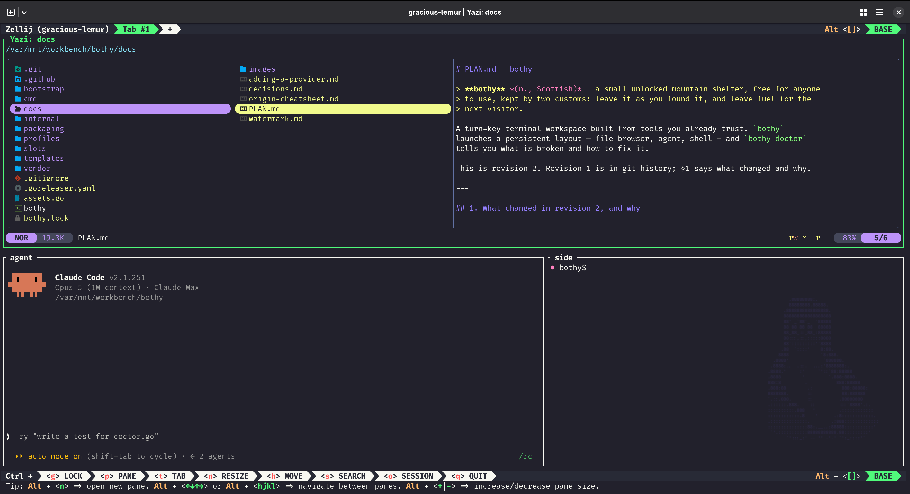

A turn-key terminal workspace built from tools you already trust. One command
opens a file browser, an agent and a shell in one window, configured and
verified, using the tools you already have.

The default <code>cockpit</code> layout, inside Zellij. Click for full size.

- [The code, and how to install it](https://github.com/bspeelm/bothy)
- [How this was built](how-it-was-built.html)
